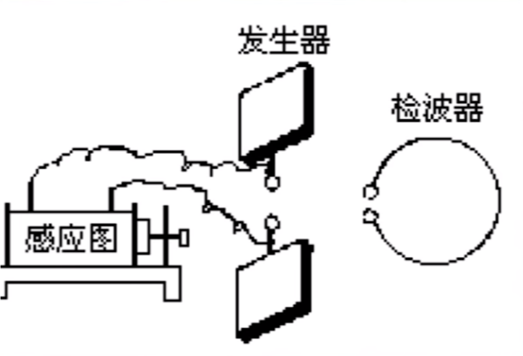
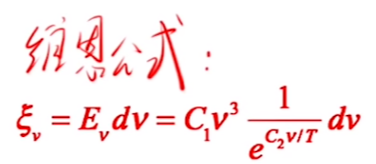
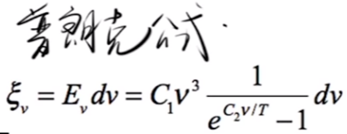
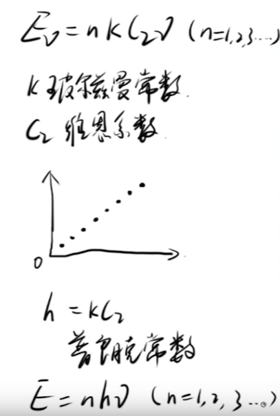
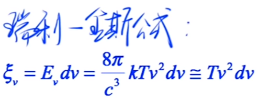
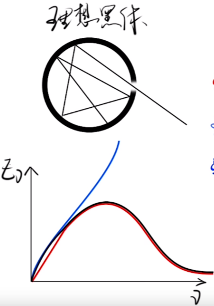
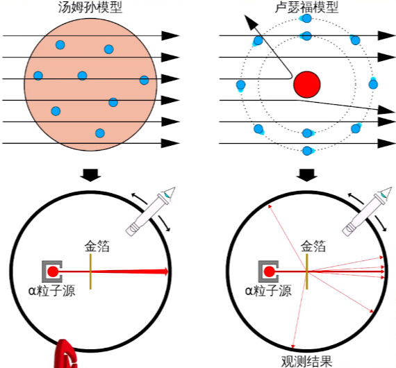

## 量子力学历史时间线

#### 本历史时间线根据**妈咪说MommyTalk**[量子故事会](https://www.youtube.com/watch?v=CF1Mg9pVh8M&list=PLYtoePJQbGmiO08bS7xF78czdQy6gDw9Q&index=1)内容总结而成
#### 生成工具 [mdline](https://github.com/azu/mdline)
#### 生成命令行
```
$ sudo apt install npm
$ sudo npm install mdline -g
$ mdline ./history-of-quantum.md history-of-quantum.html
```

## 1884年:
氢原子光谱规律
 + **牛顿**，让太阳光透过三棱镜，发现了光谱
    
 + 后来，人们发现，通过灼烧不同元素的光，透过三棱镜，得到的光谱也各不相同
    

人们发现太阳光的光谱是连续的，而氢原子光谱为非连续。

后来，由科学家**约翰・雅克布・巴耳末**发现了氢原子光谱公式。


## 1862年:
**古斯塔夫基尔霍夫**提出黑体辐射。
## 1864年:
**詹姆斯・克拉克・麦克斯韦**给出了麦克斯韦方程的第一版。之后出版了《电磁理论》一书，详细记录了电磁波的各种性质，并通过公式计算出了电磁波的传播速度。

## 1879年:
**赫尔曼・冯・亥姆霍兹**向柏林普鲁士研究院提出悬赏问题，希望有人证明**詹姆斯・克拉克・麦克斯韦**的电磁理论。

## 1887年:
**赫尔曼・冯・亥姆霍兹**的学生**海因里希・赫兹**通过直线型开放震荡器证明了电磁波的存在。

这之后**海因里希・赫兹**通过进一步实验，发现了光电效应。
##### 最重要的在于*光电效应*反映了电子是否被光子激发，和光的强度无关，与光的频率相关。
##### 简单理解光电效应，就类似于人搬运箱子到莫个台阶，箱子是否能被搬运到一定高度的台阶，和人数无关，而与人的身高相关。

### 1896年:
**威廉・维恩**根据热力学公式，给出黑体的公式。



## 1897年:
**约瑟夫・汤姆森**发现电子。

## 1900年: 

76岁的**威廉・汤姆森（开尔文男爵）**发表演讲：目前物理界有两朵乌云，第一朵为物质如何穿过**以太**运动； 第二朵 统计力学中的能量均分定理可能会被打破。

+ 第一朵乌云对应的就是，迈克尔・威尔逊的光速恒定实验。（相对论）
+ 第二朵对应的就是黑体辐射实验。（量子论）
   - 氢原子光谱规律(参考1884年**氢原子光谱规律**部分)
   - 光电效应
     + 迈克尔・法拉第
     + 威廉・韦伯
     + 赫尔曼・冯・亥姆霍兹
   - 黑体辐射
   - 原子的稳定性

**马克斯・普朗克**小心的发表了普朗克公式。



并且在同年发现了普朗克能量方程，并提出了量子论。


## 1905年
**詹姆士・金斯**将**瑞丽・琼斯**的黑体公式加以完善，发表了瑞丽-金斯公式。


其中*瑞丽-金斯公式*相比较*维恩公式*，在低频的部分，描述更符合实验结果。其中普朗克公式最符合实验结果。


**阿尔伯特・爱因斯坦**通过*光电效应*与*普朗克能量方程*，提出光子概念。

**欧内斯特，卢瑟福**完善了老师**约瑟夫・汤姆森**的原子模型。


## 1999-12: ECMAScript 3

Added regular expressions, better string handling, new control statements, try/catch exception handling, tighter definition of errors, formatting for numeric output and other enhancements.

## 2000-01--2007-10-23: [Abandoned] ECMAScript 4

Fourth Edition was abandoned, due to political differences concerning language complexity. Many features proposed for the Fourth Edition have been completely dropped; some were incorporated into the sixth edition.

