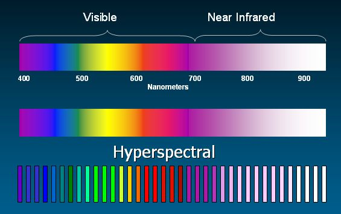
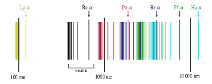
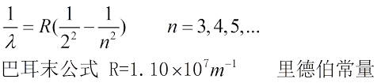

## 量子历史时间线

#### 本历史时间线根据**妈咪说MommyTalk** 和 网络内容总结而成
#### 生成工具 [mdline](https://github.com/azu/mdline)
#### 生成命令行
```
$ sudo apt install npm
$ sudo npm install mdline -g
$ mdline ./history-of-quantum.md history-of-quantum.html
```

## 1884年:
氢原子光谱规律
 + 牛顿，让太阳光透过三棱镜，发现了光谱
    
 + 后来，人们发现，通过灼烧不同元素的光，透过三棱镜，得到的光谱也各不相同
    

人们发现太阳光的光谱是连续的，而氢原子光谱为非连续。

后来，由科学家**约翰・雅克布・巴耳末**发现了氢原子光谱公式。


## 1900年: 

76岁的**威廉・汤姆森（开尔文男爵）**发表演讲：目前物理界有两朵乌云，第一朵为物质如何穿过**以太**运动； 第二朵 统计力学中的能量均分定理可能会被打破。

+ 第一朵乌云对应的就是，迈克尔・威尔逊的光速恒定实验。（相对论）
+ 第二朵对应的就是黑体辐射实验。（量子论）
   - 氢原子光谱规律
     + 牛顿，让太阳光透过三棱镜，发现了光谱
        
     + 后来，人们发现，通过灼烧不同元素的光，透过三棱镜，得到的光谱也各不相同
        
   - 光电效应
   - 黑体辐射
   - 原子的稳定性

## 1998-06: ECMAScript 2

Editorial changes to keep the specification fully aligned with ISO/IEC 16262 international standard.

## 1999-12: ECMAScript 3

Added regular expressions, better string handling, new control statements, try/catch exception handling, tighter definition of errors, formatting for numeric output and other enhancements.

## 2000-01--2007-10-23: [Abandoned] ECMAScript 4

Fourth Edition was abandoned, due to political differences concerning language complexity. Many features proposed for the Fourth Edition have been completely dropped; some were incorporated into the sixth edition.